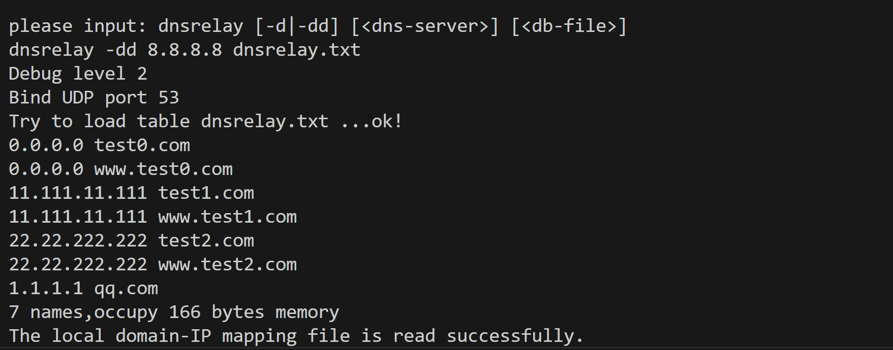
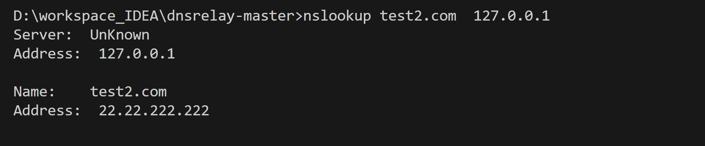
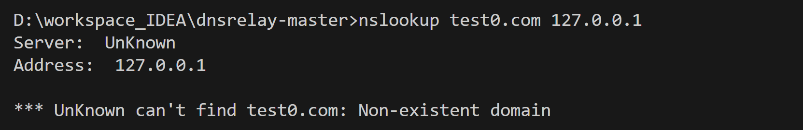
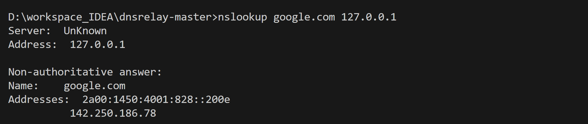

# DNS Relay Server (Java · Maven)

A lightweight DNS relay server that supports:
1) Local domain → IP lookup  
2) Website blocking via `0.0.0.0`  
3) Recursive forwarding to upstream DNS when no local entry exists  

This project was built to deeply understand DNS message parsing, packet forwarding, network concurrency, and local DNS policy enforcement.

---

##  Features

| Feature | Description |
|--------|-------------|
| UDP DNS server | Listens on port **53** |
| Local domain → IP mapping | Reads from `dnsrelay.txt` |
| Website blocking | Domain mapped to `0.0.0.0` |
| Upstream recursive lookup | Queries upstream DNS when no local mapping |
| DNS message parsing | Header / Question / Resource Record |
| Multithreaded execution | Thread pool for concurrent requests |
| Debug levels | `-d` and `-dd` |
| Pure Java | Implemented via `DatagramSocket` |

---

##  Core Logic

When receiving a DNS request:

| Situation | Behavior |
|-----------|----------|
| Domain found, mapped to `0.0.0.0` | Return "Domain not found" (site blocking) |
| Domain found, mapped to valid IP | Directly return IP |
| Domain NOT found | Forward request to upstream DNS |

This implements three roles:
- **Blocker**
- **Authoritative local DNS**
- **Recursive relay**

---

## Project Structure

```text
dnsrelay-master
├─ .idea
│  ├─ .name
│  ├─ codeStyles
│  │  ├─ codeStyleConfig.xml
│  │  └─ Project.xml
│  ├─ compiler.xml
│  ├─ encodings.xml
│  ├─ jarRepositories.xml
│  ├─ misc.xml
│  ├─ runConfigurations.xml
│  ├─ vcs.xml
│  └─ workspace.xml
├─ dnsrelay.txt
├─ pom.xml
├─ README.md
├─ src
│  ├─ main
│  │  └─ java
│  │     └─ com
│           └─ dnsrelay
│  │              ├─ DNSHeader.java
│  │              ├─ DNSQuestion.java
│  │              ├─ DNSRelayServer.java
│  │              ├─ DNSRR.java
│  │              ├─ QueryParser.java
│  │              └─ Utils.java
│  └─ test
│     └─ java
│        └─ com
│           └─ dnsrelay
│                 ├─ DNSRelayServerTest.java
│                 └─ UtilsTest.java
└─ target
   ├─ classes
   │  └─ com
   │       └─ dnsrelay
   │           ├─ DNSHeader.class
   │           ├─ DNSQuestion.class
   │           ├─ DNSRelayServer.class
   │           ├─ DNSRR.class
   │           ├─ QueryParser.class
   │           └─ Utils.class
   ├─ generated-sources
   │  └─ annotations
   ├─ generated-test-sources
   │  └─ test-annotations
   └─ test-classes
      └─ com
         └─ dnsrelay
               ├─ DNSRelayServerTest.class
               └─ UtilsTest.class

```

## Usage

### Build

```bash
mvn clean package
```

### Output

```bash
target/dnsrelay-*.jar
```

### Run

```bash
dnsrelay [-d | -dd] <dns-server> <db-file>
```

> Flag Description
> * -d: Basic debug
> * -dd: Verbose debug

### Example

1. dnsrelay start
Frist running the `.jar` file and start the dnsrelay server.

```bash
dnsrelay -dd 8.8.8.8 dnsrelay.txt   
```



2. Local lookup
Use nslookup to lookup local stored dns data

```bash
nslookup test2.com  127.0.0.1 
```


3. Block record
For block record (0.0.0.0) stored in the local dns, not found response will be generated:

```bash
nslookup test0.com  127.0.0.1 
```


4. Upstream forwarding
For the DNS that is not stored locally, upstream forwarding will be performed using the DNS server specified when starting the dnsrelay server:
```bash
nslookup google.com  127.0.0.1 
```


## How It Works

1. Load mapping file
File is parsed into a HashMap: `domain → IP`

2. Receive DNS request
`UDP → port 53 → Byte decode`

3. Parse DNS message
`DNSHeader`, `DNSQuestion`, `DNSRR`

4. Decision

```bash
if domain in map:
    if IP == 0.0.0.0 → return NXDOMAIN
    else             → return local answer
else:
    forward to upstream DNS
    return upstream response
```
5. Send response to client

6. Multithreading
Each request handled independently via thread pool.

## mplementation Notes

* UDP server using `DatagramSocket`
* Each DNS query processed inside thread pool
* Local mapping enables:
  * Fast local resolution
  * Website blocking
* Falls back to upstream resolver if necessary
* Minimal dependency; pure Java
* Supports nslookup / dig testing

## Skills practiced

* Java networking (`DatagramSocket`)
* Parsing binary DNS packets
* DNS protocol (Header/Question/RR)
* Domain → IP policy mapping
* Recursive DNS forwarding implementation
* Multithreaded concurrency (`ExecutorService`)
* CLI and debug design
